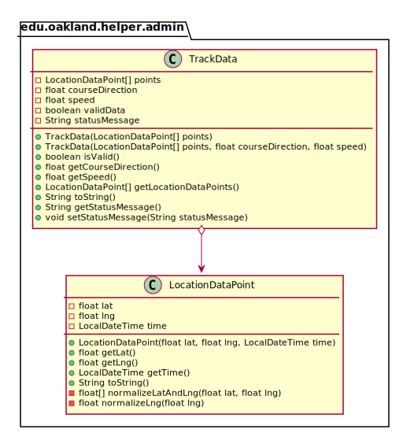

# UML Class Diagrams: edu.oakland.helper.admin.TrackData

**Primary Owner:** Brendan Fraser, Project SCRUM Master ([@brendanfraser597](https://github.com/brendanfraser597/))

**Secondary Owners:**

- Tessa Peruzzi, Project SCRUM Assistant Master ([@TessaPeruzzi](https://github.com/TessaPeruzzi/))
- Andrew Dimmer, Project SCRUM Integration Master ([@andrewdimmer](https://github.com/andrewdimmer/))

## Purpose

This class shall...

## Class UML Diagram

Below is a diagram of the TrackData class itself:

View larger as [.png](./TrackData.png) or [.svg](./TrackData.svg)

## Direct Dependencies UML Diagram

Below is a diagram of the direct dependencies required by the TrackData class:

View larger as [.png](./TrackData_DirectDependencies.png) or [.svg](./TrackData_DirectDependencies.svg)

## Complete Dependency Closure UML Diagram

Below is a diagram of the complete dependencies closure of the TrackData class:

View larger as [.png](./TrackData_Closure.png) or [.svg](./TrackData_Closure.svg)
