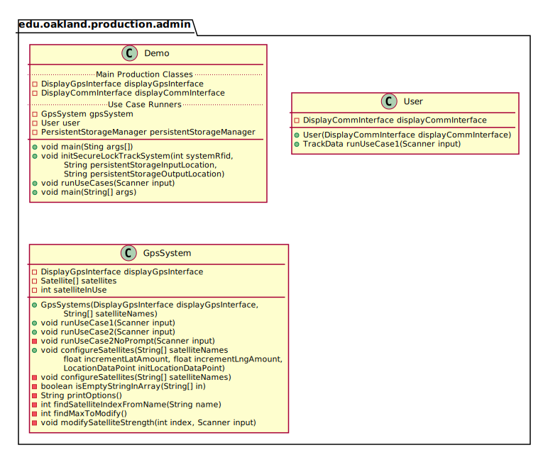
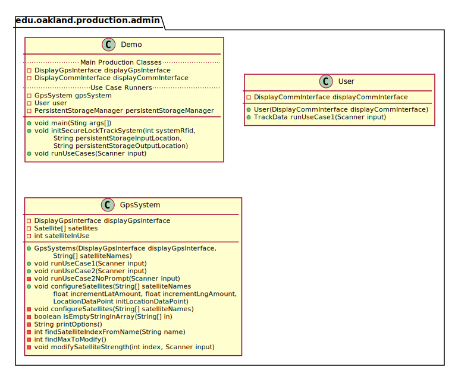

# UML Class Diagrams: edu.oakland.production.admin

**Primary Owner:** Brendan Fraser, Project SCRUM Master ([@brendanfraser597](https://github.com/brendanfraser597/))

**Secondary Owners:**

- Tessa Peruzzi, Project SCRUM Assistant Master ([@TessaPeruzzi](https://github.com/TessaPeruzzi/))
- Andrew Dimmer, Project SCRUM Integration Master ([@andrewdimmer](https://github.com/andrewdimmer/))

## Purpose

This package shall...

## Intrerfaces

This package does not contain any interfaces.

## Classes

This package contains the following classes:

- [edu.oakland.production.admin.Demo](Demo)
- [edu.oakland.production.admin.User](User)
- [edu.oakland.production.admin.GpsSystem](GpsSystem)

## Class UML Diagram

Below is a diagram of the edu.oakland.production.admin package itself:

View larger as [.png](./AdminProductionPackage.png) or [.svg](./AdminProductionPackage.svg)

## Internal Dependencies UML Diagram

Below is a diagram of the internal dependencies within the edu.oakland.production.admin package:

View larger as [.png](./AdminProductionPackage_InternalDependencies.png) or [.svg](./AdminProductionPackage_InternalDependencies.svg)

## Direct Dependencies UML Diagram

Below is a diagram of the direct dependencies required by the edu.oakland.production.admin package:

View larger as [.png](./AdminProductionPackage_DirectDependencies.png) or [.svg](./AdminProductionPackage_DirectDependencies.svg)

## Complete Dependency Closure UML Diagram

Below is a diagram of the complete dependencies closure of the edu.oakland.production.admin package:

View larger as [.png](./AdminProductionPackage_Closure.png) or [.svg](./AdminProductionPackage_Closure.svg)
