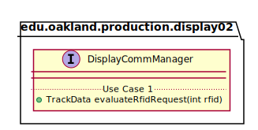

# UML Class Diagrams: edu.oakland.production.display02.DisplayCommManager

**Primary Owner:** Jessica Cortes, Display_02 Team SCRUM Master ([@jcortes18](https://github.com/jcortes18/))

**Secondary Owners:**

- Sydney Hill, Display_02 Team SCRUM Assistant Master ([@sydneyhill3901](https://github.com/sydneyhill3901/))
- Jonathan Chan, Display_02 Team SCRUM Integrator ([@Volter43](https://github.com/Volter43/))

## Purpose

This interface shall...

## Class UML Diagram

Below is a diagram of the DisplayCommManager interface itself:

View larger as [.png](./DisplayCommManager.png) or [.svg](./DisplayCommManager.svg)

## Direct Dependencies UML Diagram

Below is a diagram of the direct dependencies required by the DisplayCommManager interface:

View larger as [.png](./DisplayCommManager_DirectDependencies.png) or [.svg](./DisplayCommManager_DirectDependencies.svg)

## Complete Dependency Closure UML Diagram

Below is a diagram of the complete dependencies closure of the DisplayCommManager interface:

View larger as [.png](./DisplayCommManager_Closure.png) or [.svg](./DisplayCommManager_Closure.svg)
